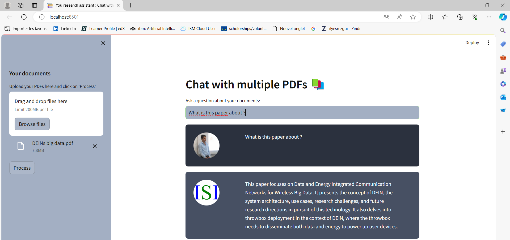

# Chat_With_PDF

<b></b>This repository implements a chat with pdf application.</b>
We use OpenAi's embeddings for feature extraction and GPT-3 for responding. Open source models can be utilized as well. 

  
  
  You can upload the pdf from the side bar, process them by clicking on process then start asking you pdf through the text area.
  
