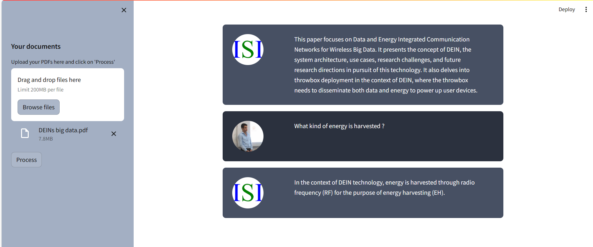

# Chat_With_PDF

<b></b>This repository implements a chat with pdf application.</b>
We use OpenAi's embeddings for feature extraction and GPT-3 for responding. Open source models can be utilized as well. 

  
  
  
